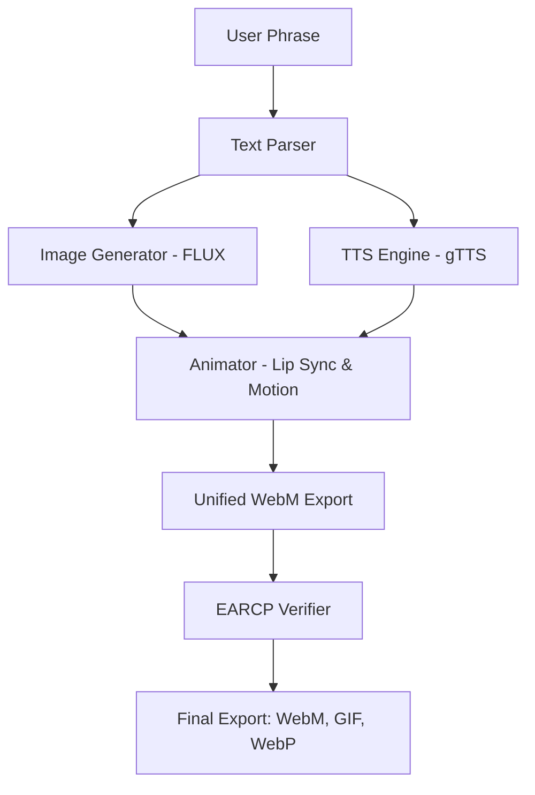
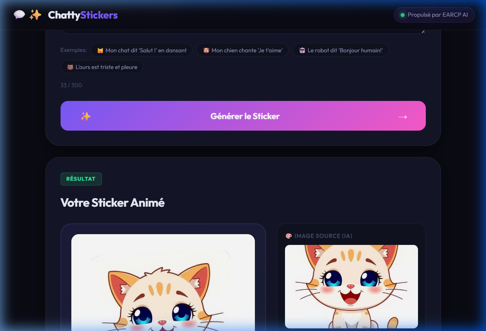
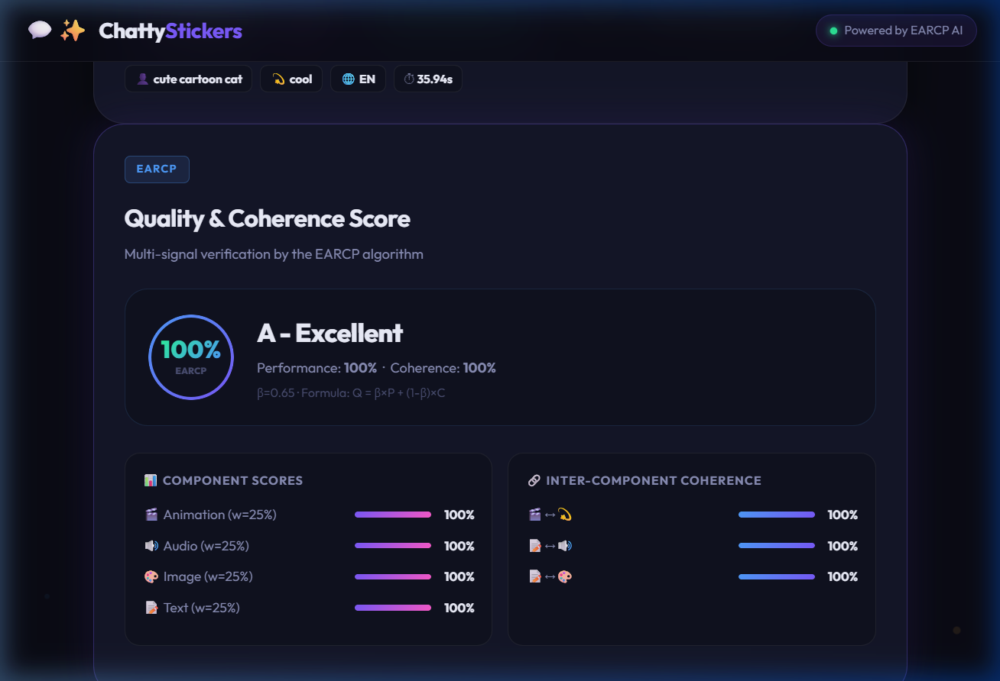

# ChattyStickers — AI Animated & Talking Stickers

[](https://opensource.org/licenses/MIT)
[](#coherence-verification-earcp)

ChattyStickers is an open-source, AI-powered pipeline that transforms simple text phrases into high-quality, animated, and talking stickers. It uses state-of-the-art models for image generation (FLUX), text-to-speech (gTTS), and motion AI, all validated by the **EARCP** multi-expert algorithm for perfect coherence.


## 🚀 Native Innovation: Talking Stickers
Unlike standard silent stickers, ChattyStickers generates unified **WebM (VP9/Opus)** files that embed both high-quality animation and synchronized AI voice.

- **Primary Format**: WebM (Multimodal)
- **Fallbacks**: Animated GIF (Silent), Animated WebP (Silent)
- **Quality**: FLUX.1 (Schnell/Dev) for premium visuals

---

## 🛠️ Features

- **Multimodal FUSION**: Generates image, voice, and animation in sync.
- **EARCP Validation**: Real-time scoring of quality and coherence (Text vs. Image vs. Audio).
- **English/French Support**: Automatically detects and translates your intent.
- **Web Interface**: Clean, modern UI for instant generation and multi-format download.
- **Open Source**: Built with Flask, PIL, OpenCV, and HuggingFace API.

---

## 🏗️ Architecture



---

## 📦 Installation & Setup

### 1. Clone the repository
```bash
git clone https://github.com/Volgat/chattystickers.git
cd chattystickers
```

### 2. Install dependencies
Ensure you have Python 3.10+ installed.
```bash
pip install -r requirements.txt
```

### 3. Configure Environment
Create a `.env` file in the root directory:
```env
HUGGINGFACE_TOKEN=your_hf_token_here
```

### 4. Run the application
```bash
python app.py
```
Open `http://localhost:5000` in your browser.

---

## 🖼️ Usage Instructions

1. **Describe your sticker**: Enter a phrase like *"A cool cartoon pirate cat laughing loudly on treasure"*.
2. **Generate**: Click the "Generate Sticker" button.
3. **Wait for Pipeline**:
   - 🧠 Analyzing text...
   - 🎨 Generating AI Image (SDXL/FLUX)...
   - 🔊 Voice Synthesis TTS...
   - 🎬 Animating sticker...
   - 🛡️ EARCP Verification...
4. **Preview & Download**: Listen to your sticker and download it in your preferred format.



---

## 🛡️ Coherence Verification (EARCP)

Every sticker is validated by the **EARCP (Expert Agreement for Reliable Coherence Parsing)** algorithm. It measures:
- **Component Scores**: Quality of individual media (Image, Audio, Animation).
- **Inter-component Coherence**: Agreement between the text intent and the visual/auditory result.



---

## 🤝 Integration

You can integrate ChattyStickers into your own discord/telegram bots via our API:

**Endpoint**: `POST /api/generate`
**Payload**: `{"phrase": "My phrase"}`
**Response**:
```json
{
  "success": true,
  "sticker": {
    "url": "/output/abc/sticker.webm",
    "type": "webm",
    "has_audio": true
  },
  "earcp_report": { "score": 0.99, "grade": "A" }
}
```

---

## 📜 License
Published under the **MIT License**. See [LICENSE](LICENSE) for details.

Developed with ❤️ by **Mike Amega** powered by **EARCP AI**.
